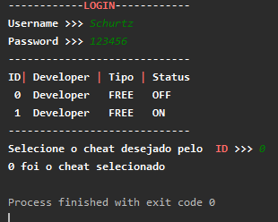

# Loader in python with login integration IPS4

Loader with menu developed in python using a login integration with the ips community of tools 4.
## loader Screenshots:

Screenshots:

## Tutorial
- edit /PHP DOCUMENTS/conn.php
- upload in server /PHP DOCUMENTS/conn.php and /PHP DOCUMENTS/login.php
- edit your path em loader.py

## Crédits:  
[Leonardo Amaro](https://github.com/leonardoamaro-dev/)
